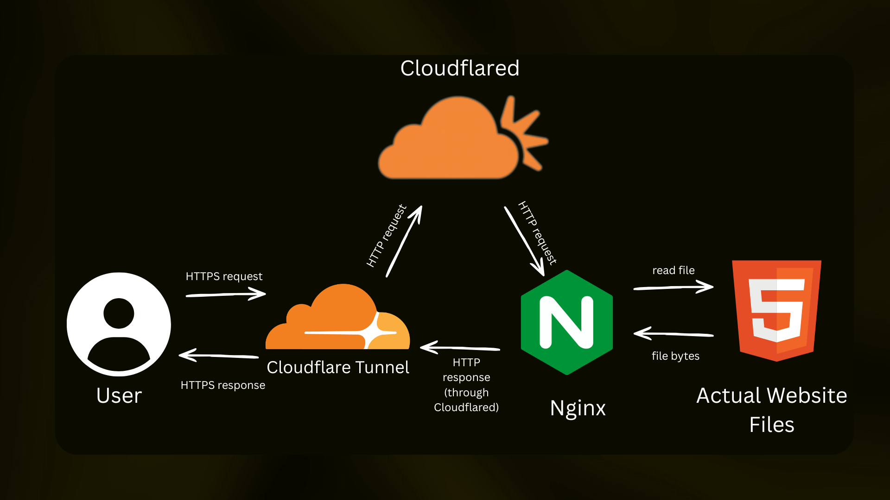

# rpi_website

Host your own website on a Raspberry Pi with a single command. Traffic routes through a Cloudflare Tunnel — no open router ports, no exposed home IP, SSL included.

> ❗ **For static websites only.** Cloudflare Tunnel routes all traffic through Cloudflare's infrastructure — they can see the full payload of everything transmitted. Do not use this to host anything with databases, user logins, or sensitive information.

> 🛠️ **Hobby project.** This software has not been tested over a long period of time and comes with no guarantees of stability, security, or continued maintenance. Use at your own risk.



---

## Requirements

- A Raspberry Pi Zero (for more models, see the [Compatibility](#compatibility) section)
- Raspberry Pi OS Lite flashed to an SD card with SSH enabled
- A domain name
- A free [Cloudflare account](https://www.cloudflare.com)

---

## How it works

When someone visits your domain, this is what happens step by step:

```
1. Visitor types your domain in their browser
        ↓
2. DNS resolves to Cloudflare (not your home IP)
        ↓
3. Cloudflare handles the HTTPS connection and SSL certificate
        ↓
4. Cloudflare forwards the request through the encrypted tunnel
        ↓
5. cloudflared (running on your Pi) receives it and passes it to nginx
        ↓
6. nginx reads the requested file from /var/www/html and sends it back
        ↓
7. Response travels back through the tunnel → Cloudflare → visitor's browser
```

**What each piece does:**

- **Cloudflare** — acts as the front door. Handles SSL, hides your home IP, provides DDoS protection. Your domain's DNS points here, not at your Pi directly.
- **cloudflared** — a small background process running on the Pi that keeps a permanent outbound connection to Cloudflare. Because it connects *outward*, your router never needs any ports opened. Restarts automatically on boot.
- **nginx** — the web server running on the Pi. Reads your HTML, CSS, and image files from `/var/www/html` and serves them. Also sets security headers on every response.
- **ufw** — the firewall. Blocks all inbound traffic except SSH. Blocks the Pi from reaching other devices on your home network. Allows only what's needed outbound: DNS, HTTPS, and the Cloudflare tunnel.
- **fail2ban** — watches SSH login attempts. Automatically bans any IP that fails too many times, protecting against brute-force attacks.
- **Management GUI** — a small web app running only on the Pi's localhost. Lets you upload files, check status, and view logs. Only reachable through an SSH tunnel from your laptop — never exposed to the internet.

---

## Setup

### Step 1 — Flash your Pi

1. Download [Raspberry Pi Imager](https://www.raspberrypi.com/software/)
2. Choose **Raspberry Pi OS Lite 32-bit** (Bullseye)
3. Click the ⚙️ settings icon before writing:
   - Enable SSH
   - Set username `pi` and a password
   - Configure your WiFi if not using ethernet
4. Flash the SD card, insert into Pi, power on
5. Find your Pi's IP address from your router's device list, then SSH in:
```bash
ssh pi@<your-pi-ip>
```

---

### Step 2 — Add your domain to Cloudflare

1. Sign up for a free account at [cloudflare.com](https://www.cloudflare.com)
2. Click **Add a site** → enter your domain → choose the **Free** plan
3. Cloudflare scans your DNS — click **Continue**
4. Cloudflare shows you two nameservers, e.g.:
   ```
   elsa.ns.cloudflare.com
   gary.ns.cloudflare.com
   ```
5. Copy them — you'll need them in the next step

---

### Step 3 — Point your domain to Cloudflare

Log in to your domain registrar (e.g. GoDaddy) and update the nameservers:

- **GoDaddy**: My Products → your domain → DNS → Nameservers → Change → Custom → paste Cloudflare's nameservers → Save

Propagation takes 15–60 minutes. Your Cloudflare dashboard will show the domain as **Active** when done. You can also verify:
```bash
dig yourdomain.com NS
```
You should see Cloudflare nameservers in the result.

---

### Step 4 — Create a Cloudflare tunnel token

1. Go to [one.dash.cloudflare.com](https://one.dash.cloudflare.com) → **Networks → Tunnels → Create a tunnel**
2. Choose **Cloudflared**, give it a name (e.g. `my-pi`)
3. Copy the token shown — you'll use it in Step 6

---

### Step 5 — Create a Cloudflare API token

This allows the installer to automatically configure your DNS and tunnel route.

1. Go to [dash.cloudflare.com/profile/api-tokens](https://dash.cloudflare.com/profile/api-tokens)
2. Click **Create Token** → **Create Custom Token**
3. Add these two permissions:
   - `Zone → DNS → Edit`
   - `Account → Cloudflare Tunnel → Edit`
4. Under **Zone Resources** set **Include → All zones**
5. Click **Continue to summary → Create Token**
6. Copy the token — it is only shown once

---

### Step 6 — Run the installer

SSH into your Pi, then run:

```bash
git clone https://github.com/davidpavlicek36/rpi_website.git
cd rpi_website
sudo CF_TOKEN=<tunnel-token> CF_API_TOKEN=<api-token> DOMAIN=yourdomain.com bash install.sh
```

| Variable | What it is | Format |
|---|---|---|
| `CF_TOKEN` | Tunnel token from Step 4 | `eyJhIjoiZ...` |
| `CF_API_TOKEN` | API token from Step 5 | `abc123...` |
| `DOMAIN` | Your domain — root only, no `www`, no `https://` | `yourdomain.com` |

The installer takes 2–5 minutes. When it finishes, your site is live at `https://www.yourdomain.com`.

> **Note:** `CF_API_TOKEN` and `DOMAIN` are optional. If you omit them, the installer still runs but you must configure the tunnel public hostname manually in the Cloudflare dashboard after (see [Troubleshooting](#troubleshooting)).

---

### Step 7 — Upload your website

Open an SSH tunnel from your laptop:
```bash
ssh -L 8080:localhost:8080 pi@<your-pi-ip>
```
Then open `http://localhost:8080` in your browser and use the **Upload Files** page to upload your HTML, CSS, and images.

---

## Manage your site

The management GUI runs on the Pi but is only accessible through an SSH tunnel — it is never reachable from the internet.

**Step 1** — open a tunnel from your laptop:

```bash
ssh -L 8080:localhost:8080 pi@<your-pi-ip>
```

**Step 2** — open your browser:

```
http://localhost:8080
```

### What you can do

| Page | What it does |
|---|---|
| **Dashboard** | nginx + tunnel status, file list |
| **Upload Files** | Drag-and-drop HTML, CSS, images, fonts — individual files or whole folders |
| **Tunnel & Domain** | Check tunnel status, restart it, replace the tunnel token, update domain & DNS |
| **Logs** | Live nginx access and error logs |

### Change your tunnel token or domain later

You don't need to re-run the installer. Use the **Tunnel & Domain** page, or the command line on the Pi:

```bash
# Replace the tunnel token (paste the token, then press Enter and Ctrl+D)
sudo rpi-webhost-config set-token

# Point www.<domain> at the tunnel (Cloudflare API token read from stdin, never stored)
read -rs -p "API token: " T; echo; printf '%s\n' "$T" | sudo rpi-webhost-config set-domain example.com; unset T

sudo rpi-webhost-config status
```

- The API token needs **Zone:Read, DNS:Edit and Cloudflare Tunnel:Edit**. It is used once and never written to disk.
- `set-token` checks the new token, applies it, and waits for the tunnel to connect. If it doesn't connect within about 40 seconds, the previous token is restored automatically.
- `set-domain` keeps any other hostnames you've added to the tunnel.
- Already installed an older version? Re-run `install.sh` once. It now refreshes the GUI, helper and sudoers rules and leaves your site files and config alone.

---

## Security

The installer applies the following automatically:

- **Cloudflare Tunnel** — no inbound ports open on your router; all web traffic is outbound-initiated
- **LAN isolation** — RFC1918 ranges (`10.x`, `172.16.x`, `192.168.x`) are blocked outbound; a compromised Pi cannot reach other devices on your home network. System DNS is switched to Cloudflare (1.1.1.1) so name resolution still works
- **Least-privilege service** — the management GUI runs as a dedicated `rpi-webhost` system user, not root, with basic systemd sandboxing. Its own code is root-owned and read-only to that user. It can only restart cloudflared and run `rpi-webhost-config` through narrow sudoers entries
- **Host and CSRF protection** — the GUI only answers requests addressed to `localhost` / `127.x.x.x` (this blocks DNS-rebinding attacks from web pages you visit while the SSH tunnel is open), and rejects POSTs from any other origin
- **Tunnel token kept private** — stored in a root-only file (`/etc/cloudflared/tunnel.env`), not on the cloudflared command line where every local user could read it with `ps`. Re-running the installer migrates older installs
- **Audit log** — every token or domain change is written to the system log: `journalctl -t rpi-webhost-config`
- **Verified downloads** — cloudflared is checked against the SHA-256 GitHub publishes for the release before it is installed. Pin the GUI code to a release with `sudo RPI_WEBHOST_REF=<tag> bash install.sh` (or install from a git clone, which is used automatically)
- **Security updates keep flowing** — outbound port 80 is allowed so plain-HTTP apt mirrors work (packages are GPG-signed); unattended-upgrades is enabled
- **Real visitor IPs** — nginx is configured to read `CF-Connecting-IP` from the tunnel so logs and fail2ban see actual IPs, not `127.0.0.1`
- **HSTS** — nginx sends `Strict-Transport-Security` which Cloudflare forwards to browsers
- **fail2ban** — bans IPs after 5 failed SSH attempts in 10 minutes
- **SSH hardening** — root login disabled, `MaxAuthTries 3`, `LoginGraceTime 20`
- **GUI on localhost only** — never bound to a public interface

**SSH password login** is switched off automatically when the installer finds an SSH key on the Pi (so it can never lock you out of a Pi without one). If you have no key yet:

```bash
# On your laptop
ssh-copy-id pi@<your-pi-ip>

# Then re-run the installer (or: sudo sed -i 's/^#\?PasswordAuthentication.*/PasswordAuthentication no/' /etc/ssh/sshd_config && sudo systemctl reload ssh)
```

Installer options (environment variables): `KEEP_SSH_PASSWORD=1` leaves password login on, `RPI_WEBHOST_REF=<tag|commit>` pins the downloaded GUI code, `CLOUDFLARED_SKIP_VERIFY=1` skips the checksum check if the GitHub API is unreachable (not recommended).

---

## Compatibility

**Tested on:** Raspberry Pi Zero 1 WH — Raspberry Pi OS Lite 32-bit (Bullseye)

The following models should work but have not been tested. Use the recommended OS to maximise compatibility:

| Model | Recommended OS | Confidence |
|---|---|---|
| Pi Zero 1 / W / WH | Pi OS Lite **32-bit** (Bullseye) | ✅ Tested |
| Pi Zero 2 W | Pi OS Lite **32-bit** (Bullseye) | 🟡 Untested — nearly identical setup |
| Pi 2 / Pi 3 | Pi OS Lite **32-bit** (Bullseye) | 🟡 Untested — should work |
| Pi 4 | Pi OS Lite **32-bit** (Bullseye) | 🟡 Untested — use Bullseye, not Bookworm |
| Pi 5 | Pi OS Lite **64-bit** (Bookworm) | 🔴 Untested — Bookworm only, may need manual fixes |

> Avoid the desktop version of Pi OS — Lite is recommended for any server use. Always flash using [Raspberry Pi Imager](https://www.raspberrypi.com/software/) and enable SSH in the Advanced Settings before writing.

---

## Troubleshooting

**Cloudflare error page (1033, 530, 502, 522…) or the site stopped working**
Run the read-only health check on the Pi. It checks the tunnel, firewall, DNS, nginx and the GUI, and says whether the tunnel or the origin is at fault:
```bash
curl -fsSL https://raw.githubusercontent.com/davidpavlicek36/rpi_website/main/diagnose.sh -o diagnose.sh
sudo bash diagnose.sh
```
It changes nothing and never prints tokens, so its output is safe to paste into an issue. A weekly GitHub Actions run checks that the packages and cloudflared downloads the installer relies on still exist, but firewall, DNS and Pi Zero (armv6) behaviour can only be verified on real hardware with this script.

**Installer appears frozen at "Enabling firewall"**
This is a known SSH buffering behaviour — the firewall step applies kernel-level rules which takes time on a Pi Zero (up to 2-3 minutes). The installer is running fine in the background, the output is just buffered by the SSH connection and not displayed yet. Wait 1-2 minutes, then press `Ctrl+C`. The buffered output will flush and you will see that all steps completed successfully. Do not re-run the installer.

**SSH connection refused**
SSH is disabled by default on a fresh Pi OS install. Enable it in Raspberry Pi Imager (Advanced Settings → Enable SSH) before flashing, or connect a keyboard and run `sudo systemctl enable --now ssh`.

**Site not loading**
```bash
sudo systemctl status nginx
sudo systemctl status cloudflared
```
Check that the Public Hostname in the Cloudflare dashboard points to `http://localhost:80`.

**Tunnel not connecting**
```bash
sudo journalctl -u cloudflared -n 50
```
Make sure outbound port 443 is not blocked and the token is correct.

**Can't reach the GUI**
Make sure the SSH tunnel is open (`ssh -L 8080:localhost:8080 pi@<ip>`) and visit `http://localhost:8080` — not https.

**GUI service not running**
```bash
sudo systemctl status rpi-webhost
sudo systemctl restart rpi-webhost
```

